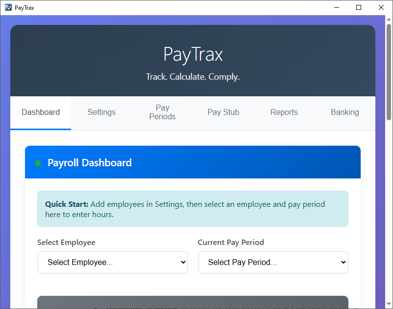

# PayTrax: Client-Side Payroll Management

**Track. Calculate. Comply.**

**PayTrax** is a standalone, browser-based payroll management system designed for small businesses and solo entrepreneurs. It operates entirely on the client-side, meaning it doesn't require a server or an internet connection after the initial page load. All your sensitive payroll data is stored securely and privately in your own browser, giving you complete control.

This application was built entirely by Gemini 2.5 Pro to demonstrate a robust, modular, and data-persistent web application using only HTML, CSS, and vanilla JavaScript.



## Key Features

- **Dynamic Payroll Dashboard:**  
  Enter hours for employees and see gross pay, net pay, and total payroll costs calculated in real-time.
- **Comprehensive Settings:**  
  Configure company details, pay frequencies, tax rates, and employee information all in one place.
- **Employee Management:**  
  Easily add, edit, and manage your employees, including their pay rates, tax withholding, and PTO balances.
- **Pay Stub Generation:**  
  Create professional, detailed, and printable pay stubs for any employee and any pay period.
- **Compliance Reporting:**  
  Generate the data you need for key tax forms, including:
    - Tax Deposit Schedules
    - Annual W-2 Data
    - Quarterly IRS Form 941 Data
    - Annual IRS Form 940 Data
    - Custom date-range reports for wages and employer expenses.
- **Integrated Bank Register:**  
  Track payroll debits automatically and manage other transactions in a simple bank ledger to monitor your cash flow.
- **Data Portability:**  
  Securely export your entire application data to a JSON file for backup and import it just as easily.
- **100% Client-Side & Private:**  
  Your data never leaves your computer. **PayTrax** uses your browser's IndexedDB for robust and private local storage.

## How It Works (Technical Overview)

**PayTrax** is built with a modern, modular architecture without relying on any external frameworks.

- **Vanilla JavaScript (ES Modules):**  
  The code is logically separated into modules for state management (`state.js`), business logic (`logic.js`), UI rendering (`ui.js`), and data persistence (`db.js`), making it clean and maintainable.
- **Single State Object:**  
  The entire application's state is managed in a single `appData` object, providing a single source of truth for all calculations and UI updates.
- **IndexedDB Persistence:**  
  **PayTrax** uses the browser's IndexedDB to reliably store all application data. It includes a graceful fallback to localStorage and a migration path to ensure data integrity.
- **Data Migration:**  
  The import functionality includes a versioning and migration system, allowing data from older versions of the application to be safely imported and updated to the latest structure.

## Getting Started

Because **PayTrax** is a fully client-side application, getting started is incredibly simple.

1. **Clone the repository:**
    ```sh
    git clone https://github.com/greenwh/PayTrax.git
    ```
2. **Navigate to the directory:**
    ```sh
    cd PayTrax
    ```
3. **Open the application:**  
   A simple server is required (see `start_paytrax_server.bat`) if the application is not installed using a distribution.  
   Simply open the `PayTrax.html` file in your preferred web browser (like Chrome, Firefox, or Edge). That's it!

## Basic Usage Workflow

1. Navigate to the **Settings** tab. Fill out your Company Settings, Tax Settings, and add your first employee in the Employee Management section.
2. Go to the **Dashboard** tab.
3. Select the employee you just created from the dropdown menu.
4. Select a pay period and enter the hours worked.
5. All calculations will update instantly. You can then generate a pay stub or view the updated reports.

## Contributing

Contributions are welcome! If you'd like to help improve **PayTrax**, please fork the repository and submit a pull request with your changes.

## License

## Copyright & AI Attribution

Copyright (c) 2025 greenwh

This software was developed by greenwh, with substantial assistance from AI coding tools (Claude, ChatGPT, Gemini 2.5 Pro). Development was based on original documentation, spreadsheets, and workflow prompts created by greenwh. No third-party code or assets have been included unless otherwise noted.

**AI Workflow:**  
Development involved iterative prompting to multiple AI coding platforms, resulting in modular, original code. The overall application logic, structure, and idea are original to greenwh.

If you use or modify this code, please retain this attribution.

