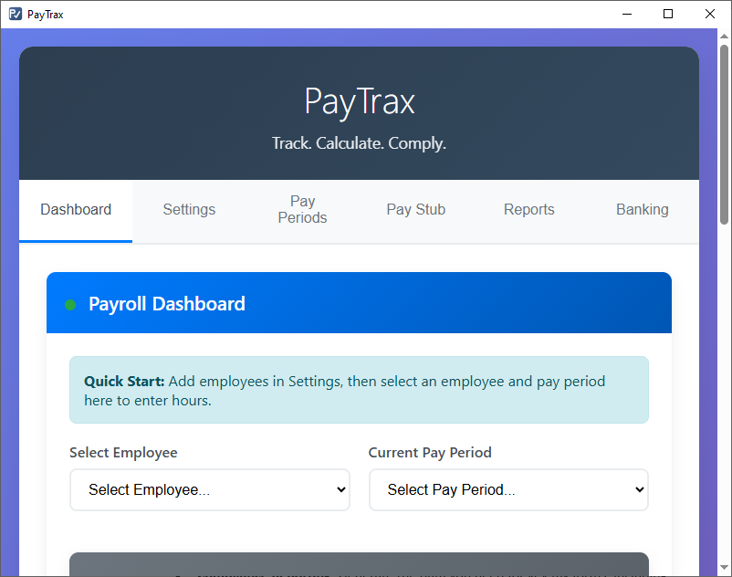

# PayTrax: Client-Side Payroll Management

**Track. Calculate. Comply.**

**PayTrax** is a standalone, browser-based payroll management system designed for small businesses and solo entrepreneurs. It operates entirely on the client-side, meaning it doesn't require a server or an internet connection after the initial page load. All your sensitive payroll data is stored securely and privately in your own browser, giving you complete control.

This application was developed by `greenwh` with substantial AI assistance to demonstrate a robust, modular, and data-persistent web application using only HTML, CSS, and vanilla JavaScript.



## Key Features

-   **Dynamic Payroll Dashboard:**
    Enter hours for employees and see gross pay, net pay, and total payroll costs calculated in real-time. Includes bank fund projections for upcoming payroll costs.
-   **Comprehensive Settings:**
    Configure company details, pay frequencies, tax rates, configurable wage bases/thresholds, and tax deposit frequencies all in one place.
-   **Employee Management:**
    Easily add, edit, and manage your employees, including their pay rates, overtime/holiday multipliers, tax withholding, and PTO balances.
-   **Employee Deductions:**
    Configure recurring pre-tax deductions (401k, health insurance, union dues, etc.) as fixed dollar amounts or percentages of gross pay. Deductions are date-aware and only apply to pay periods on or after their creation date.
-   **Running Remainder Tax Algorithm:**
    Fractional cents from tax rounding carry forward between pay periods, ensuring penny-perfect accuracy across the full year.
-   **Pay Stub Generation:**
    Create professional, detailed, and printable pay stubs for any employee and any pay period, with PDF export capability.
-   **Compliance Reporting:**
    Generate the data you need for key tax forms, including:
    -   Tax Deposit Schedules (configurable frequency)
    -   Annual W-2 Data
    -   Quarterly IRS Form 941 Data (with monthly liability breakdown)
    -   Annual IRS Form 940 Data (with quarterly liability breakdown)
    -   Custom date-range reports for wages and employer expenses
    -   **CSV export** for all report types
-   **Advanced Bank Register:**
    -   **Auto Bank Subtraction:** Payroll costs are automatically deducted from your register.
    -   **Reconciliation:** Mark transactions as reconciled to balance your books.
    -   **Inline Editing:** Edit transactions directly in the register.
    -   **Dynamic Filtering:** Instantly filter by date, description, or reconciled status.
    -   **CSV Import:** Import bank statement CSVs with automatic format detection and optional auto-reconciliation.
    -   **CSV Export:** Export the currently filtered view to CSV.
    -   **Data Purge:** Safely purge old reconciled transactions with automatic opening balance creation.
-   **Data Portability:**
    Securely export your entire application data to a JSON file for backup and import it just as easily. Older backups are automatically migrated to the current format.
-   **100% Client-Side & Private:**
    Your data never leaves your computer. **PayTrax** uses your browser's IndexedDB for robust and private local storage with automatic unsaved-changes warnings.
-   **Progressive Web App:**
    Install PayTrax on your device for offline use with full service worker caching.

## How It Works (Technical Overview)

**PayTrax** is built with a modern, modular architecture without relying on any external frameworks.

-   **Vanilla JavaScript (ES Modules):**
    The code is logically separated into 12 modules: core calculations (`logic.js`), employee management (`employees.js`), tax reports (`reports.js`), state management (`state.js`), UI rendering (`ui.js`), banking operations (`banking.js`), data persistence (`db.js`), data migration (`migration.js`), date utilities (`utils.js`), validation (`validation.js`), PDF export (`pdf-export.js`), and JSON import/export (`data-io.js`).
-   **Single State Object:**
    The entire application's state is managed in a single `appData` object, providing a single source of truth for all calculations and UI updates.
-   **IndexedDB Persistence:**
    **PayTrax** uses the browser's IndexedDB to reliably store all application data. It includes a graceful fallback to localStorage, debounced saves for performance, and immediate saves for critical operations.
-   **Data Versioning & Migration:**
    The application includes a comprehensive versioning and migration system (currently at v9). Data migrations run automatically both on startup (IndexedDB load) and during JSON import, ensuring older data is always brought up to date.
-   **Automated Testing:**
    301 tests across 11 test files using Vitest with Playwright browser mode, covering payroll calculations, tax reports, wage base caps, sequential recalculation, deductions, migrations, utilities, validation, and database operations.

## Getting Started

Because **PayTrax** is a fully client-side application, getting started is incredibly simple.

1.  **Clone the repository:**
    ```sh
    git clone https://github.com/greenwh/PayTrax.git
    ```
2.  **Navigate to the directory:**
    ```sh
    cd PayTrax
    ```
3.  **Open the application:**
    For the JavaScript modules to work correctly, you need to serve the files locally. Many tools can do this, but a simple one is Python's built-in web server.
    ```sh
    # If you have Python 3 installed
    python -m http.server
    ```
    Then, open your browser and navigate to `http://localhost:8000`.

4.  **Run tests (optional):**
    ```sh
    npm install   # First time only
    npm test      # Run all 301 tests
    ```

## License & AI Attribution

Copyright (c) 2025 greenwh

This software is licensed under the **MIT License**. See the [LICENSE](LICENSE) file for details.

This software was developed by greenwh, with substantial assistance from AI coding tools (Claude, ChatGPT, Gemini). Development was based on original documentation, spreadsheets, and workflow prompts created by greenwh.

If you use or modify this code, please retain this attribution.
